# Tal's BassPractice — UX Case Study

An adaptive electric bass practice app. A user picks one musical genre, it locks for 30 days so they build real depth instead of hopping styles, and the app teaches that genre's history, theory, song tabs, and curated video lessons.

**Role:** Product & UX design (solo)
**Scope:** Low-fidelity wireframes → high-fidelity clickable prototype
**Deliverable:** Portfolio case study

---

## 1. Wireframes

Low-fidelity pass across all eight core screens, structure and hierarchy only, before any typography, color, or content decisions.

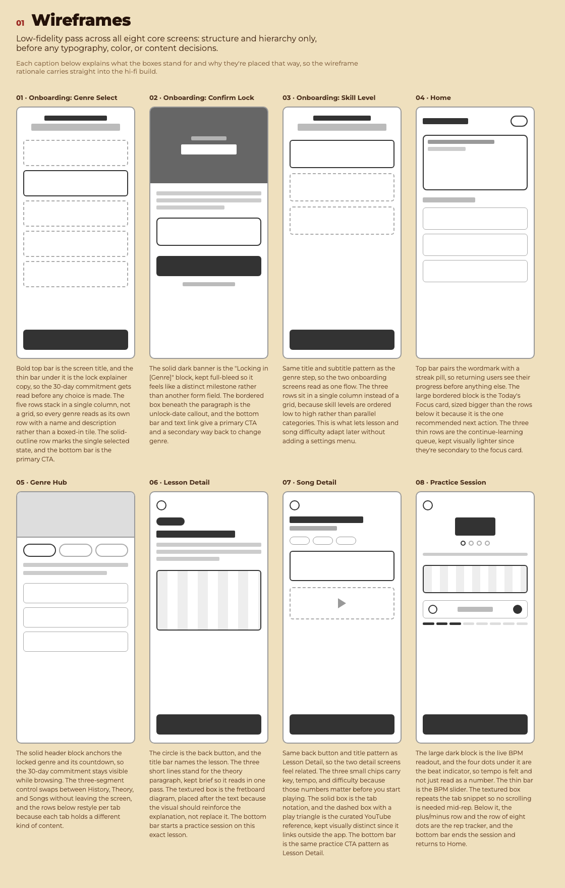

**What each screen's boxes represent, and why:**

- **Onboarding: Genre Select.** The bold top bar is the screen title, and the thin bar under it is the lock explainer copy, so the 30-day commitment gets read before any choice is made. The five rows stack in a single column, not a grid, so every genre reads as its own row with a name and description. The solid-outline row marks the single selected state, and the bottom bar is the primary CTA.
- **Onboarding: Confirm Lock.** The solid dark banner is the "Locking in [Genre]" moment, kept full-bleed so it feels like a distinct milestone rather than another form field. The bordered box beneath the paragraph is the unlock-date callout, and the bottom bar and text link give a primary CTA and a secondary way back to change genre.
- **Onboarding: Skill Level.** Same title and subtitle pattern as the genre step, so the two onboarding screens read as one flow. The three rows sit in a single column instead of a grid, because skill levels are ordered low to high rather than parallel categories.
- **Home.** The top bar pairs the wordmark with a streak pill, so returning users see their progress before anything else. The large bordered block is the Today's Focus card, sized bigger than the rows below it because it is the one recommended next action. The three thin rows are the continue-learning queue, kept visually lighter since they're secondary.
- **Genre Hub.** The solid header block anchors the locked genre and its countdown, so the 30-day commitment stays visible while browsing. The three-segment control swaps between History, Theory, and Songs without leaving the screen, and the rows below restyle per tab because each tab holds a different kind of content.
- **Lesson Detail.** The circle is the back button, and the title bar names the lesson. The three short lines stand for the theory paragraph, kept brief so it reads in one pass. The textured box is the fretboard diagram, placed after the text because the visual should reinforce the explanation, not replace it.
- **Song Detail.** Same back button and title pattern as Lesson Detail, so the two detail screens feel related. The three small chips carry key, tempo, and difficulty because those numbers matter before you start playing. The dashed box with a play triangle is the curated YouTube reference, kept visually distinct since it links outside the app.
- **Practice Session.** The large dark block is the live BPM readout, and the four dots under it are the beat indicator, so tempo is felt and not just read as a number. The textured box repeats the tab snippet so no scrolling is needed mid-rep, and the bottom bar ends the session and returns to Home.

---

## 2. Hi-fi clickable prototype

The connected flow, demoed with **Soul** locked in:

1. **Genre select** — tap any genre card
2. **Confirm 30-day lock** — "Continue"
3. **Skill level** — Beginner, Intermediate, or Advanced
4. **Home** — streak, today's focus, continue list
5. **Genre hub** — History / Theory / Songs tabs
6. **Lesson or song detail** — diagram, tab, YouTube link
7. **Practice session** — live metronome, rep tracker
8. **Finish** → back to Home, streak increments

| | |
|---|---|
| 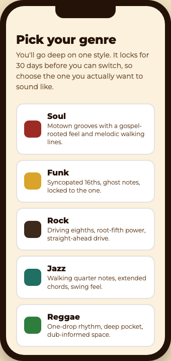 | 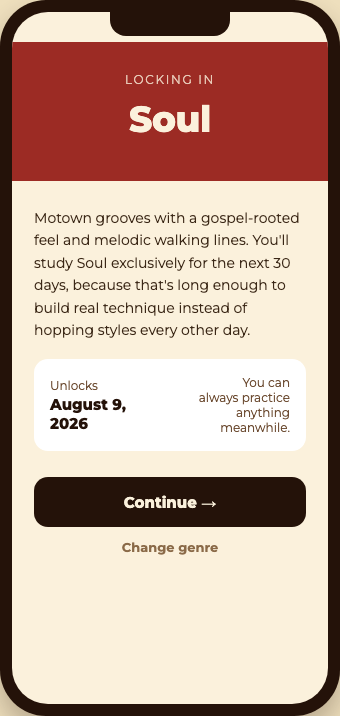 |
| 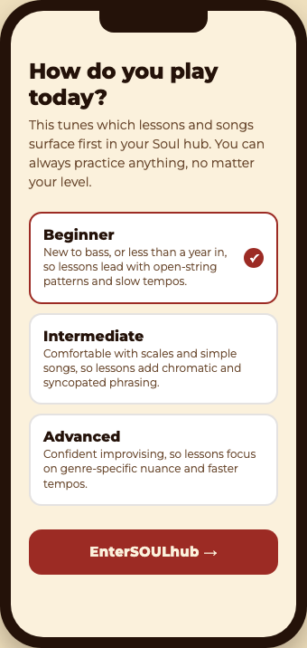 | 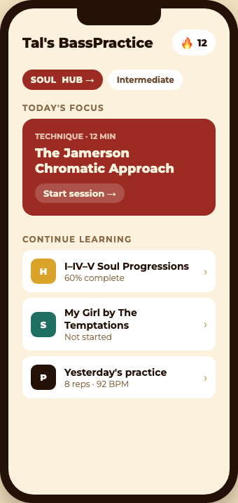 |
| 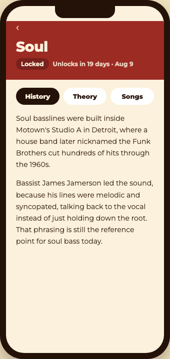 | 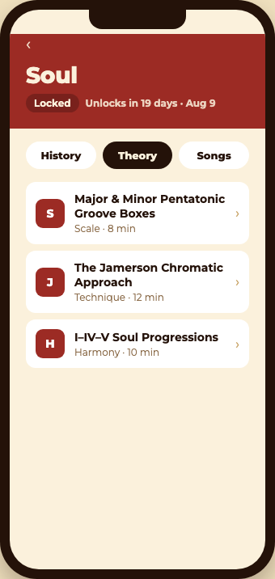 |
| 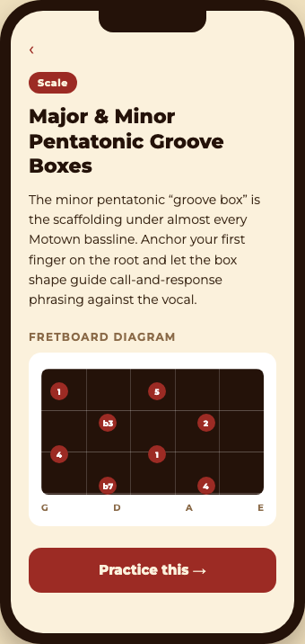 | 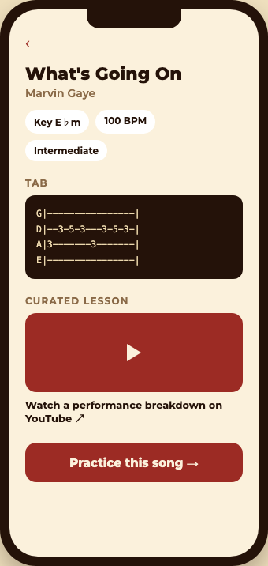 |
| 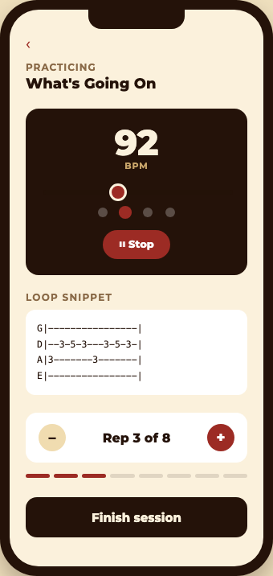 | |

The metronome and BPM slider are fully live: dragging the slider and hitting play changes the tempo reflected in the beat indicator in real time.

The `prototype/` folder holds the actual working file (`index.dc.html` + `support.js`). Open `index.dc.html` in a browser to click through it yourself.

---

## 3. UX methodology

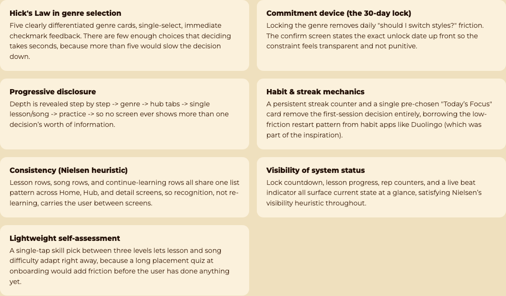

**Hick's Law in genre selection.** Five clearly differentiated genre cards, single-select, with immediate checkmark feedback. There are few enough choices that deciding takes seconds, because more than five would slow the decision down.

**Commitment device (the 30-day lock).** Locking the genre removes daily "should I switch styles?" friction. The confirm screen states the exact unlock date up front so the constraint feels transparent and not punitive.

**Progressive disclosure.** Depth is revealed step by step: genre, then hub tabs, then a single lesson or song, then practice. No screen ever shows more than one decision's worth of information.

**Habit & streak mechanics.** A persistent streak counter and a single pre-chosen "Today's Focus" card remove the first-session decision entirely, borrowing the low-friction restart pattern from habit apps like Duolingo.

**Consistency (Nielsen heuristic).** Lesson rows, song rows, and continue-learning rows all share one list pattern across Home, Hub, and detail screens, so recognition, not re-learning, carries the user between screens.

**Visibility of system status.** Lock countdown, lesson progress, rep counters, and a live beat indicator all surface current state at a glance.

**Lightweight self-assessment.** A single-tap skill pick between three levels lets lesson and song difficulty adapt right away, because a long placement quiz at onboarding would add friction before the user has done anything yet.

### Per-screen rationale

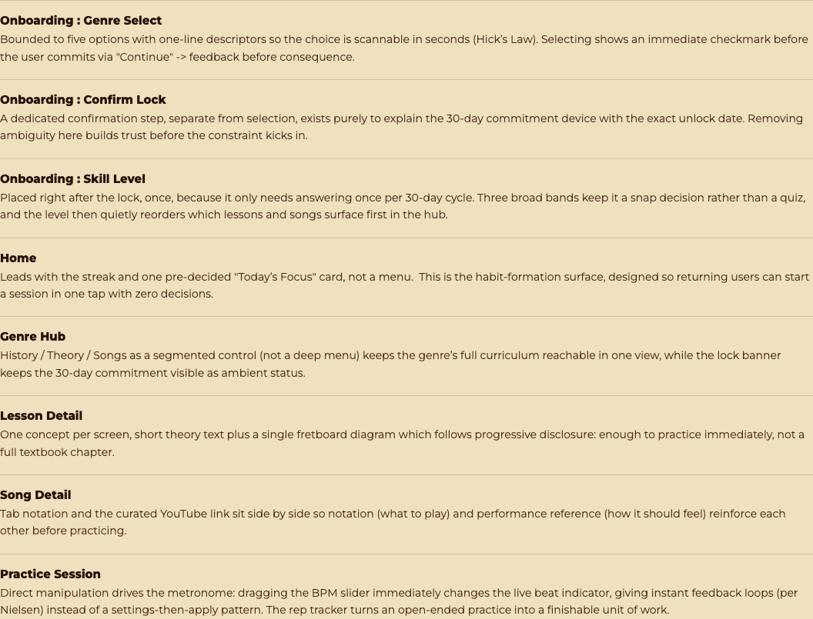

- **Onboarding: Genre Select** — Bounded to five options with one-line descriptors so the choice is scannable in seconds (Hick's Law). Selecting shows an immediate checkmark before the user commits via "Continue," feedback before consequence.
- **Onboarding: Confirm Lock** — A dedicated confirmation step, separate from selection, exists purely to explain the 30-day commitment device with the exact unlock date. Removing ambiguity here builds trust before the constraint kicks in.
- **Onboarding: Skill Level** — Placed right after the lock, once, because it only needs answering once per 30-day cycle. Three broad bands keep it a snap decision rather than a quiz, and the level then quietly reorders which lessons and songs surface first in the hub.
- **Home** — Leads with the streak and one pre-decided "Today's Focus" card, not a menu. This is the habit-formation surface, designed so returning users can start a session in one tap with zero decisions.
- **Genre Hub** — History / Theory / Songs as a segmented control (not a deep menu) keeps the genre's full curriculum reachable in one view, while the lock banner keeps the 30-day commitment visible as ambient status.
- **Lesson Detail** — One concept per screen: short theory text plus a single fretboard diagram, which follows progressive disclosure. Enough to practice immediately, not a full textbook chapter.
- **Song Detail** — Tab notation and the curated YouTube link sit side by side so notation (what to play) and performance reference (how it should feel) reinforce each other before practicing.
- **Practice Session** — Direct manipulation drives the metronome: dragging the BPM slider immediately changes the live beat indicator, an instant feedback loop instead of a settings-then-apply pattern. The rep tracker turns an open-ended practice into a finishable unit of work.

---

## Files

- `README.md` — this write-up
- `screenshots/` — exported PNGs of every wireframe and prototype state
- `prototype/index.dc.html` + `prototype/support.js` — the working clickable prototype
